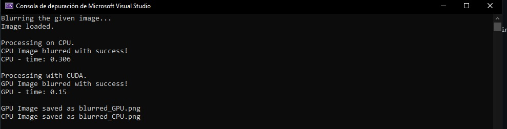

# Blur Image with CUDA

This code demonstrates how to apply a Gaussian blur filter to an image using CUDA parallel computing.

## Prerequisites

- CUDA-enabled GPU
- CUDA Toolkit
- NVIDIA Nsight (optional)

## Getting Started

1. Clone this repository or download the source code.
2. Ensure that you have CUDA Toolkit installed on your system.
3. Open the project in Visual Studio Community (or your preferred IDE).
4. Build the project to generate the executable file.

## Usage

1. Prepare an input image file (e.g., `input_image.png`) in the same directory as the executable.
2. Run the executable.
3. The program will apply a Gaussian blur filter to the input image using both CPU and GPU implementations.
4. The blurred images will be saved as `blurred_CPU.png` and `blurred_GPU.png` respectively.

## Code Description

The following code is a C++ program that performs a blur on an image using both the CPU and the GPU. The program uses the `lodepng` library for loading and saving PNG images, and the `cuda_runtime.h` and `device_launch_parameters.h` libraries for programming with CUDA.

### Description of Main Functions

#### `blur`

The `blur` function is a kernel that runs on the GPU and is responsible for applying blur to the input image. It takes as parameters a pointer to the input image, a pointer to the output image, the width and the height of the image.

Within the kernel, an offset is calculated that represents the current position of the thread in the 2D thread grid. Then the coordinates (`x` and `y`) corresponding to the displacement are calculated. Next, the size of the filter (`fsize`) is defined.

Inside a `for` loop, iterates over the neighboring pixels around the current pixel. Neighboring pixels are checked to be within the image boundaries. The color channel values of the neighboring pixel are then accessed and added to the blur result.

Finally, the accumulated result is divided by the number of neighboring pixels considered (`hits`) and saved in the corresponding color channels of the output pixel.

#### `filterCPU`

The `filterCPU` function performs the blurring on the CPU. It takes as parameters a pointer to the input image, a pointer to the output image, the width and the height of the image. This feature is used as a performance comparison with blur on the GPU.

The implementation is similar to the `blur` function, but instead of running on the GPU, it runs on the CPU using nested loops to iterate over neighboring pixels and perform the blur calculation.

#### `filterGPU`

The `filterGPU` function is in charge of coordinating the execution of the blur on the GPU. It takes as parameters a pointer to the input image, a pointer to the output image, the width and the height of the image.

Inside the function, the following is done:
1. Choose the GPU on which the code will run.
2. Memory is allocated on the GPU device for input and output data.
3. The input data is copied from the host memory to the GPU device memory.
4. The block and grid dimensions are defined for the `blur` kernel execution.
5. The kernel is launched on the GPU to perform the blur.
6. It is checked if there were any errors during the kernel launch.
7. The GPU device is synchronized to ensure that the kernel execution has finished.
8. The output data is copied from the GPU device memory to the host memory.
9. The allocated memory on the GPU device is freed.

### Program Execution

The `main` function is the entry point of the program. Here the following is done:
1. Load the input image data using the `lodepng` library.
2. Data is prepared for blurring: a byte array for the input image is created and the byte array for the output images is initialized.
3. The blur is executed on the CPU using the `filterCPU` function and the execution time is measured.
4. The blur is executed on the GPU using the `filterGPU` function and the execution time is measured.
5. Prepare the data for output: byte arrays are converted to byte vectors, and alpha channel is added to the output images.
6. The output images are saved using the `lodepng` library.
7. Dynamically allocated memory arrays are freed.

### Compilation and Execution

To compile the program, make sure you have a C++ compiler and CUDA development environment installed. Then you can use the following command:
- nvcc -o blur_paralela_CCOMP blur_paralela_CCOMP.cpp
Remember that you must have an image called "messi1.png" in the same directory as the program for it to work correctly.

### Results

The program will generate two output images: "blurred_GPU.png" and "blurred_CPU.png". These images will contain the blurred version of the input image obtained using blur on the GPU and on the CPU, respectively.

In addition, the blur runtime on the GPU and CPU will be displayed in the console so that performance can be compared.

I hope this explanation is useful to you. If you have any additional questions, feel free to ask.

## Notes

- The code uses the LodePNG library for image loading and saving. The source code file `lodepng.cpp` is included in the project.
- The CPU implementation is provided as a reference for comparison with the GPU implementation.

## Acknowledgments

- Remember that the files "lodepng.cpp" and "lodepng.h" belong to the library from which I was guided to make the code. The link where you can find both files is the following: https://github.com/retep998/Wiki/blob/master/lodepng.cpp

## Results GPU_CPU

### Using CPU:

### Using GPU:

### V.S.C:

